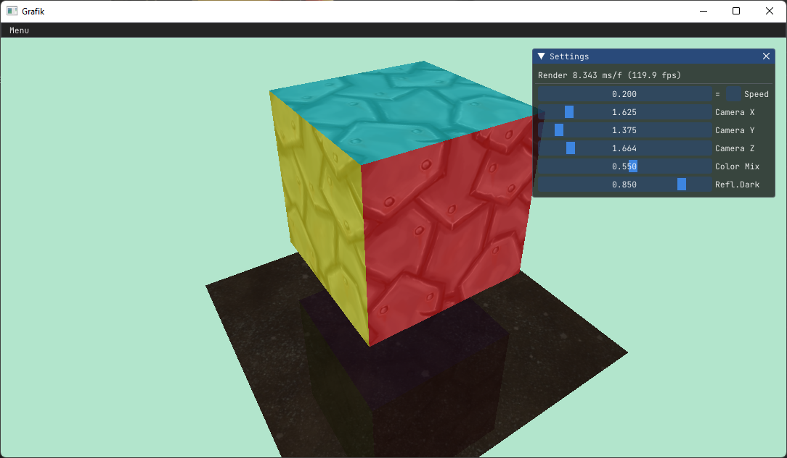

# Grafik

### Vulkan + OpenGL Shader Experiments

Small application for experimenting with real-time rendering.

| Startup options          |                                        |
| :----------------------- | :------------------------------------- |
| `-vulkan`, `-v`      | Start with vulkan as graphics API      |
| `-lab lab`, `-l lab` | Load experiment &lt;lab&gt; on startup |

@mndvsn
